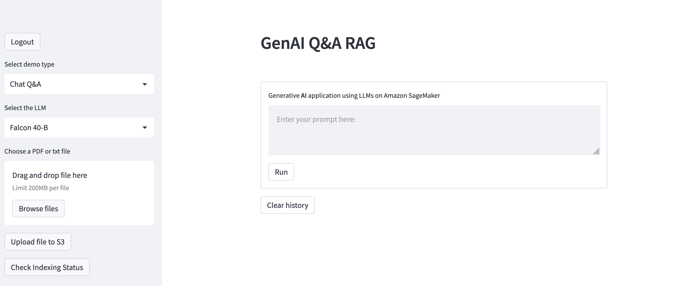
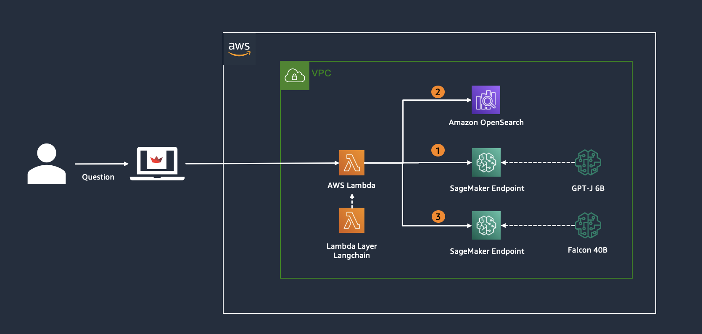
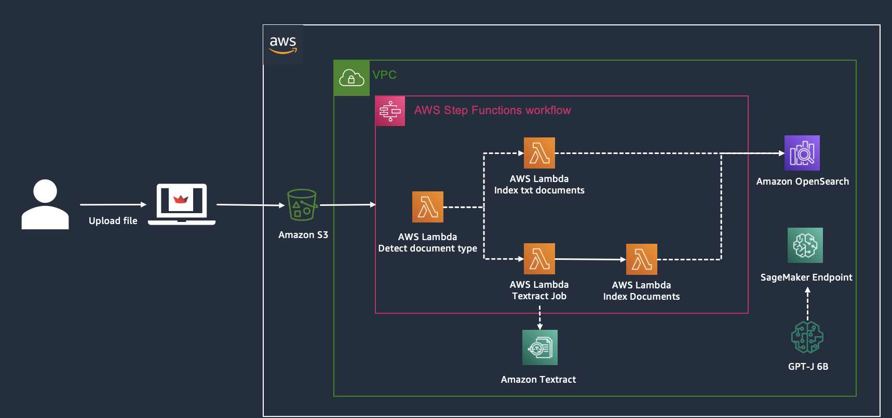

# AWSI Generative AI Product

## Architecture

### User Interaction

### Document Indexing

## Repository Content

1. [app](./app): Streamlit app for testing the GenAI application
2. [backend](./backend): Lambda function used as backend for the GenAI application
3. [data_workflow](./data_workflow): Lambda functions used in the StepFunction workflow for indexing PDF and txt documents
4. [fargate](./fargate): Fargate content for deploying the frontend app using Fargate
5. [notebooks](./notebooks): Jupyter notebooks for testing the SageMaker Endpoints, and indexing workflows
6. [setuo](./setup): CFN template for deploying the AWS resources

## Prerequisites

1. Create an Amazon OpenSearch cluster as follows:
   2. Select Managed clusters
   3. Click "Create Domain"
   4. Select "Standard create"
   5. Under "Templates", Select "Dev/test"
   6. Under "Deployment Option(s)", select "Domain without standby"
   7. Under "Engine options", select "Elasticsearch - 7.10"
   8. Under "Network", select Public access
   9. Under "Fine-grained access control", select "Enable fine-grained access control"
      10. Create master user
   11. Under "Access policy", select "Only use fine-grained access control"

2. Put the [lambda_layers](./data_workflow/lambda_layers) zip files in an Amazon S3 bucket
   1. [pdf-parser-layer](./data_workflow/lambda_layers/pdf-parser-layer)
   2. [poppler](./data_workflow/lambda_layers/poppler)

3. Put the [lambda layer](./backend/lambda_layers) zip files in an Amazon S3 bucket
   1. [langchain](./backend/lambda_layers/langchain)

4. Upload the [configs.yaml](./backend/configs.yaml) file for the Lambda backendEdit the file `configs.yaml`
   1. es_credentials: Amazon OpenSearch credentials for connecting to the ElastichSearch domain
   2. embeddings: Add the SageMaker Endpoint with the Embedding models you want to use in your application
   3. llms: Add the SageMaker Endpoint with the LLMs you want to use in your application

## Deployment

1. Deploy [cfn-template.yml](./setup/cfn-template.yml)
2. Edit [configs.yaml](./fargate/chat_ui/configs.yaml)
   1. aws: AWS Credentials for invoking the Lambda backend
   2. s3: Bucket info from the created Amazon S3 bucket from the point 1
3. Deploy [fargate](./fargate)
   1. `./fargate/deploy_stack.sh`